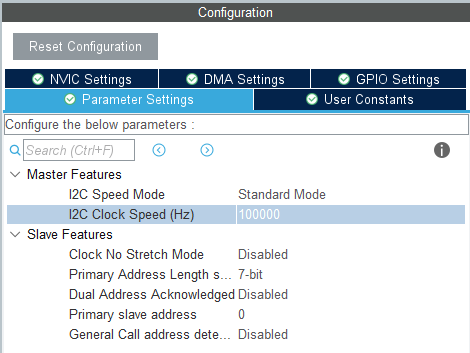
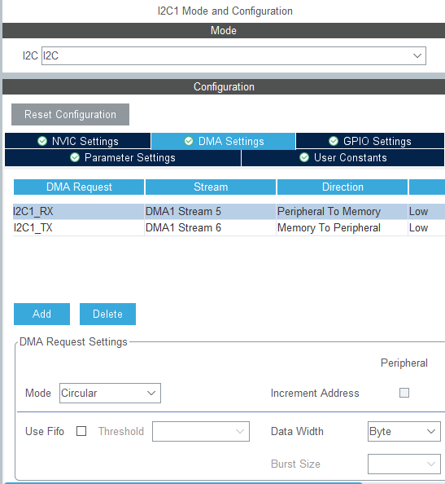
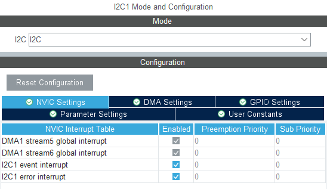
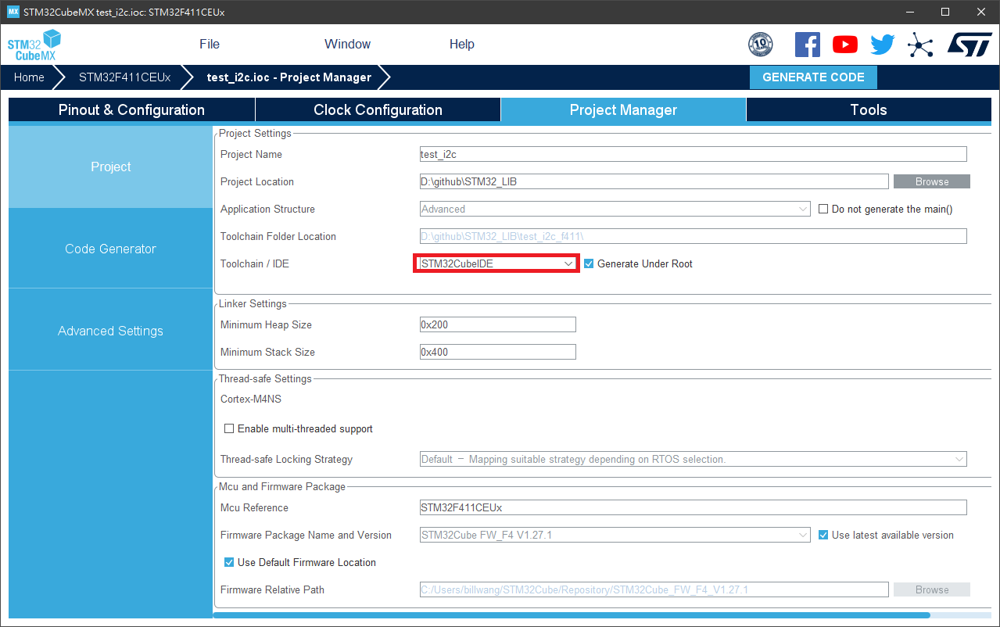
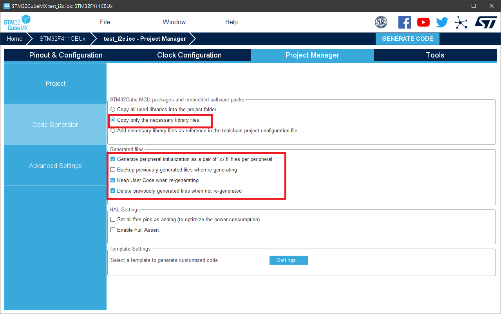

# STM32 I2C Programming Note

***Target MCU: STM32F411CEU6***

Table of Content
<!--TOC-->
  - [STM32CubeMX](#stm32cubemx)
    - [Setup I2C Peripheral](#setup-i2c-peripheral)
    - [Project Setting](#project-setting)
  - [Programming](#programming)
    - [I2C peripheral Initialization](#i2c-peripheral-initialization)
    - [DMA Initialization](#dma-initialization)
    - [I2C interrupt Callback](#i2c-interrupt-callback)
    - [DMA TX Interrupt](#dma-tx-interrupt)
    - [DMA RX Interrupt](#dma-rx-interrupt)
    - [DMA Read/Write Function](#dma-readwrite-function)
  - [References](#references)
<!--/TOC-->

## STM32CubeMX

### Setup I2C Peripheral

- Speed



- DMA



- Interrupt



### Project Setting




## Programming

### I2C peripheral Initialization
```c
I2C_HandleTypeDef hi2c1;
DMA_HandleTypeDef hdma_i2c1_rx;
DMA_HandleTypeDef hdma_i2c1_tx;

void MX_I2C_Init(uint32_t clockSpeed, uint32_t dutyCycle)
{

	/* USER CODE BEGIN I2C1_Init 0 */

	/* USER CODE END I2C1_Init 0 */

	/* USER CODE BEGIN I2C1_Init 1 */

	/* USER CODE END I2C1_Init 1 */
	hi2c1.Instance = I2C1;
	hi2c1.Init.ClockSpeed = clockSpeed;
	hi2c1.Init.DutyCycle = dutyCycle;
	hi2c1.Init.OwnAddress1 = 0;
	hi2c1.Init.AddressingMode = I2C_ADDRESSINGMODE_7BIT;
	hi2c1.Init.DualAddressMode = I2C_DUALADDRESS_DISABLE;
	hi2c1.Init.OwnAddress2 = 0;
	hi2c1.Init.GeneralCallMode = I2C_GENERALCALL_DISABLE;
	hi2c1.Init.NoStretchMode = I2C_NOSTRETCH_DISABLE;
	if (HAL_I2C_Init(&hi2c1) != HAL_OK)
	{
		Error_Handler();
	}
	/* USER CODE BEGIN I2C1_Init 2 */

	/* USER CODE END I2C1_Init 2 */


}

void HAL_I2C_MspInit(I2C_HandleTypeDef* i2cHandle)
{

	GPIO_InitTypeDef GPIO_InitStruct = { 0 };
	if (i2cHandle->Instance == I2C1)
	{
		/* USER CODE BEGIN I2C1_MspInit 0 */

		/* USER CODE END I2C1_MspInit 0 */

		__HAL_RCC_GPIOB_CLK_ENABLE();
		/**I2C1 GPIO Configuration
		PB7     ------> I2C1_SDA
		PB8     ------> I2C1_SCL
		*/
		GPIO_InitStruct.Pin = GPIO_PIN_7 | GPIO_PIN_8;
		GPIO_InitStruct.Mode = GPIO_MODE_AF_OD;
		GPIO_InitStruct.Pull = GPIO_NOPULL;
		GPIO_InitStruct.Speed = GPIO_SPEED_FREQ_VERY_HIGH;
		GPIO_InitStruct.Alternate = GPIO_AF4_I2C1;
		HAL_GPIO_Init(GPIOB, &GPIO_InitStruct);

		/* I2C1 clock enable */
		__HAL_RCC_I2C1_CLK_ENABLE();

		/* I2C1 DMA Init */
		/* I2C1_RX Init */
		hdma_i2c1_rx.Instance = DMA1_Stream5;
		hdma_i2c1_rx.Init.Channel = DMA_CHANNEL_1;
		hdma_i2c1_rx.Init.Direction = DMA_PERIPH_TO_MEMORY;
		hdma_i2c1_rx.Init.PeriphInc = DMA_PINC_DISABLE;
		hdma_i2c1_rx.Init.MemInc = DMA_MINC_ENABLE;
		hdma_i2c1_rx.Init.PeriphDataAlignment = DMA_PDATAALIGN_BYTE;
		hdma_i2c1_rx.Init.MemDataAlignment = DMA_MDATAALIGN_BYTE;
		hdma_i2c1_rx.Init.Mode = DMA_CIRCULAR;
		hdma_i2c1_rx.Init.Priority = DMA_PRIORITY_LOW;
		hdma_i2c1_rx.Init.FIFOMode = DMA_FIFOMODE_DISABLE;
		if (HAL_DMA_Init(&hdma_i2c1_rx) != HAL_OK)
		{
			Error_Handler();
		}

		__HAL_LINKDMA(i2cHandle, hdmarx, hdma_i2c1_rx);

		/* I2C1_TX Init */
		hdma_i2c1_tx.Instance = DMA1_Stream6;
		hdma_i2c1_tx.Init.Channel = DMA_CHANNEL_1;
		hdma_i2c1_tx.Init.Direction = DMA_MEMORY_TO_PERIPH;
		hdma_i2c1_tx.Init.PeriphInc = DMA_PINC_DISABLE;
		hdma_i2c1_tx.Init.MemInc = DMA_MINC_ENABLE;
		hdma_i2c1_tx.Init.PeriphDataAlignment = DMA_PDATAALIGN_BYTE;
		hdma_i2c1_tx.Init.MemDataAlignment = DMA_MDATAALIGN_BYTE;
		hdma_i2c1_tx.Init.Mode = DMA_CIRCULAR;
		hdma_i2c1_tx.Init.Priority = DMA_PRIORITY_LOW;
		hdma_i2c1_tx.Init.FIFOMode = DMA_FIFOMODE_DISABLE;
		if (HAL_DMA_Init(&hdma_i2c1_tx) != HAL_OK)
		{
			Error_Handler();
		}

		__HAL_LINKDMA(i2cHandle, hdmatx, hdma_i2c1_tx);

		/* I2C1 interrupt Init */
		HAL_NVIC_SetPriority(I2C1_EV_IRQn, 0, 0);
		HAL_NVIC_EnableIRQ(I2C1_EV_IRQn);
		HAL_NVIC_SetPriority(I2C1_ER_IRQn, 0, 0);
		HAL_NVIC_EnableIRQ(I2C1_ER_IRQn);
		/* USER CODE BEGIN I2C1_MspInit 1 */

		/* USER CODE END I2C1_MspInit 1 */
	}
}

void HAL_I2C_MspDeInit(I2C_HandleTypeDef* i2cHandle)
{

	if (i2cHandle->Instance == I2C1)
	{
		/* USER CODE BEGIN I2C1_MspDeInit 0 */

		/* USER CODE END I2C1_MspDeInit 0 */
		  /* Peripheral clock disable */
		__HAL_RCC_I2C1_CLK_DISABLE();

		/**I2C1 GPIO Configuration
		PB7     ------> I2C1_SDA
		PB8     ------> I2C1_SCL
		*/
		HAL_GPIO_DeInit(GPIOB, GPIO_PIN_7);

		HAL_GPIO_DeInit(GPIOB, GPIO_PIN_8);

		/* I2C1 DMA DeInit */
		HAL_DMA_DeInit(i2cHandle->hdmarx);
		HAL_DMA_DeInit(i2cHandle->hdmatx);

		/* I2C1 interrupt Deinit */
		HAL_NVIC_DisableIRQ(I2C1_EV_IRQn);
		HAL_NVIC_DisableIRQ(I2C1_ER_IRQn);
		/* USER CODE BEGIN I2C1_MspDeInit 1 */

		/* USER CODE END I2C1_MspDeInit 1 */
	}
}
```

### DMA Initialization
```c
void I2C_DMA_Init(void)
{

	/* DMA controller clock enable */
	__HAL_RCC_DMA1_CLK_ENABLE();

	/* DMA interrupt init */
	/* DMA1_Stream5_IRQn interrupt configuration */
	HAL_NVIC_SetPriority(DMA1_Stream5_IRQn, 0, 0);
	HAL_NVIC_EnableIRQ(DMA1_Stream5_IRQn);
	/* DMA1_Stream6_IRQn interrupt configuration */
	HAL_NVIC_SetPriority(DMA1_Stream6_IRQn, 0, 0);
	HAL_NVIC_EnableIRQ(DMA1_Stream6_IRQn);

}
```

### I2C interrupt Callback

	- I2C Event Interrupt
```c
void I2C1_EV_IRQHandler(void)
{
	/* USER CODE BEGIN I2C1_EV_IRQn 0 */

	/* USER CODE END I2C1_EV_IRQn 0 */
	HAL_I2C_EV_IRQHandler(&hi2c1);
	/* USER CODE BEGIN I2C1_EV_IRQn 1 */

	/* USER CODE END I2C1_EV_IRQn 1 */
}
```
    - I2C Error Interrupt
```c
void I2C1_ER_IRQHandler(void)
{
	/* USER CODE BEGIN I2C1_ER_IRQn 0 */

	/* USER CODE END I2C1_ER_IRQn 0 */
	HAL_I2C_ER_IRQHandler(&hi2c1);
	/* USER CODE BEGIN I2C1_ER_IRQn 1 */

	/* USER CODE END I2C1_ER_IRQn 1 */
}
```

### DMA TX Interrupt 

```c
// DMA1 Stream6 channel 1
volatile uint8_t i2cWriteCplt = 0;

// I2C1_TX
void DMA1_Stream6_IRQHandler(void)
{
	/* USER CODE BEGIN DMA1_Stream6_IRQn 0 */

	/* USER CODE END DMA1_Stream6_IRQn 0 */
	HAL_DMA_IRQHandler(&hdma_i2c1_tx);
	/* USER CODE BEGIN DMA1_Stream6_IRQn 1 */

	/* USER CODE END DMA1_Stream6_IRQn 1 */
}

void HAL_I2C_MemTxCpltCallback(I2C_HandleTypeDef *hi2c)
{
	// 1.Must define  I2C1_EV_IRQHandler() to work 
	// 2. Add HAL_DMA_Abort_IT(hi2c->hdmatx) at interrupt, Otherwise dmaxferstatus = HAL_DMA_Start_IT() in HAL_I2C_Mem_Write_DMA will return busy
	//  - https://community.st.com/t5/stm32cubemx-mcu/why-hal-dma-functions-are-not-working/td-p/400261
	//  - https://stackoverflow.com/questions/69027570/stm32-i2c-transfer-with-dma-completed-but-dma-interrupt-routine-is-not-work

	if (hi2c->Instance == hi2c1.Instance) {
		HAL_DMA_Abort_IT(hi2c->hdmatx);

	}
	i2cWriteCplt = 1;
}	
```

### DMA RX Interrupt 

```c
// DMA1 Stream5 channel 1
volatile uint8_t i2cReadCplt = 0;

// I2C1_RX
void DMA1_Stream5_IRQHandler(void)
{
	/* USER CODE BEGIN DMA1_Stream5_IRQn 0 */

	/* USER CODE END DMA1_Stream5_IRQn 0 */
	HAL_DMA_IRQHandler(&hdma_i2c1_rx);
	/* USER CODE BEGIN DMA1_Stream5_IRQn 1 */

	/* USER CODE END DMA1_Stream5_IRQn 1 */
}

void HAL_I2C_MemRxCpltCallback(I2C_HandleTypeDef *hi2c)
{
	// Add HAL_DMA_Abort_IT(hi2c->hdmarx) at interrupt, Otherwise dmaxferstatus = HAL_DMA_Start_IT() in HAL_I2C_Mem_Read_DMA will return busy
	//  - https://community.st.com/t5/stm32cubemx-mcu/why-hal-dma-functions-are-not-working/td-p/400261
	//  - https://stackoverflow.com/questions/69027570/stm32-i2c-transfer-with-dma-completed-but-dma-interrupt-routine-is-not-work
	if (hi2c->Instance == hi2c1.Instance) {
		HAL_DMA_Abort_IT(hi2c->hdmarx);

	}
	i2cReadCplt = 1;
}
```

### DMA Read/Write Function
```c
HAL_StatusTypeDef I2C_Master_Transmit(I2C_HandleTypeDef *hi2c, uint16_t DevAddress, uint8_t *pData, uint16_t Size, uint16_t Delay)
{
	HAL_StatusTypeDef status = HAL_I2C_Master_Transmit_DMA(hi2c, DevAddress, pData, Size);
	DELAY(Delay);
	return status;
}

HAL_StatusTypeDef I2C_Master_Write_Registers(I2C_HandleTypeDef *hi2c, uint16_t DevAddress, uint16_t MemAddress, uint16_t MemAddSize, uint8_t *pData, uint16_t Size, uint16_t Delay)
{
	HAL_StatusTypeDef status = HAL_I2C_Mem_Write_DMA(hi2c, DevAddress, MemAddress, MemAddSize, pData, Size);
	DELAY(Delay);
	return status;
}

HAL_StatusTypeDef I2C_Master_Read_Registers(I2C_HandleTypeDef *hi2c, uint16_t DevAddress, uint16_t MemAddress, uint16_t MemAddSize, uint8_t *pData, uint16_t Size, uint16_t Delay)
{
	HAL_StatusTypeDef status = HAL_I2C_Mem_Read_DMA(hi2c, DevAddress, MemAddress, MemAddSize, pData, Size);
	DELAY(Delay);
	return status;
}
```

## References

- [DMA 只跑第一次](https://community.st.com/t5/stm32cubemx-mcu/why-hal-dma-functions-are-not-working/td-p/400261)

HAL_I2C_MemTxCpltCallback 中要加
```c
if (hi2c->Instance == hi2c1.Instance) {
	HAL_DMA_Abort_IT(hi2c->hdmatx);
}
```
HAL_I2C_MemRxCpltCallback 中要加
```c
if (hi2c->Instance == hi2c1.Instance) {
	HAL_DMA_Abort_IT(hi2c->hdmarx);
}
```
- [DMA TX 不會進 HAL_I2C_MemTxCpltCallback()](https://stackoverflow.com/questions/69027570/stm32-i2c-transfer-with-dma-completed-but-dma-interrupt-routine-is-not-work)

確認有加入下列Interrupt
```c
void I2C1_EV_IRQHandler()
void I2C1_ER_IRQHandler()
void DMA1_Stream5_IRQHandler()
void DMA1_Stream6_IRQHandler()
```

